### Hi there 👋, I'm a Software Engineer with a knack of learning something new everyday. In my free time I love to learn about latest technologies and work on my logic building skills.

<h4>LinkedIn Profile --</h4>

  

  <h4>🏆 Github Profile Trophy</h4>
  

<h2>SKILLS - </h2>
 
  <h2>Programming Languages</h2>
  
 
 
 
 
 
 <h2>Tools & Libraries</h2>
 
 
 
 
 <h2>Web Development</h2>
 
 
 
 
 
 
 
 
 
 
  <h2>Database</h2>
  
 
 
 <h2>Cloud Server</h2>
 
 
 
 <h2>Operating System</h2>
 
 
 

<!--  -->

<h2>LIVE PROFILE VISITORS - </h2>
 

<h2>CONTRIBUTION GRAPH - </h2>
 

  

    
     
    

  
   

   
 
     

     
     

  

<!--
**thedeveloperyug/thedeveloperyug** is a ✨ _special_ ✨ repository because its `README.md` (this file) appears on your GitHub profile.

Here are some ideas to get you started:

- 🔭 I’m currently working on ...
- 🌱 I’m currently learning ...
- 👯 I’m looking to collaborate on ...
- 🤔 I’m looking for help with ...
- 💬 Ask me about ...
- 📫 How to reach me: ...
- 😄 Pronouns: ...
- ⚡ Fun fact: ...
-->
